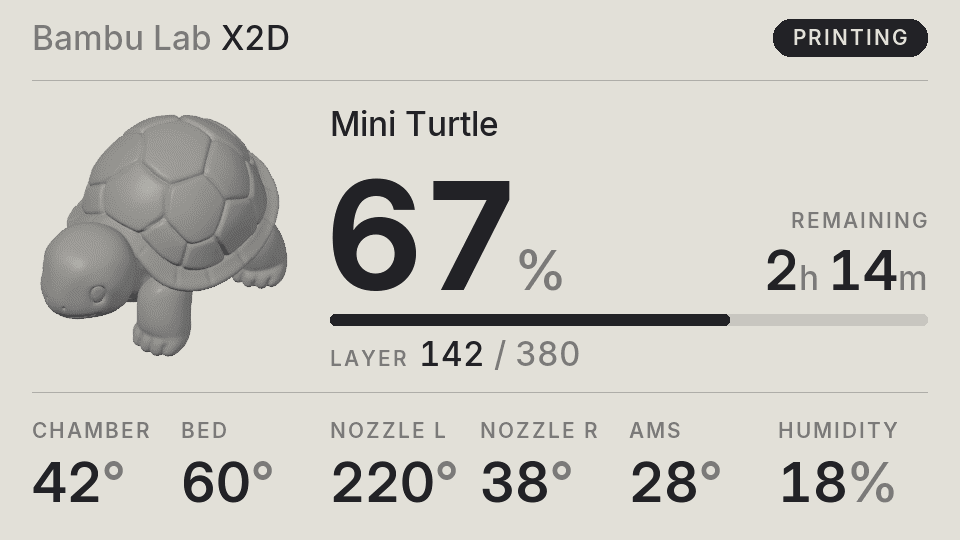
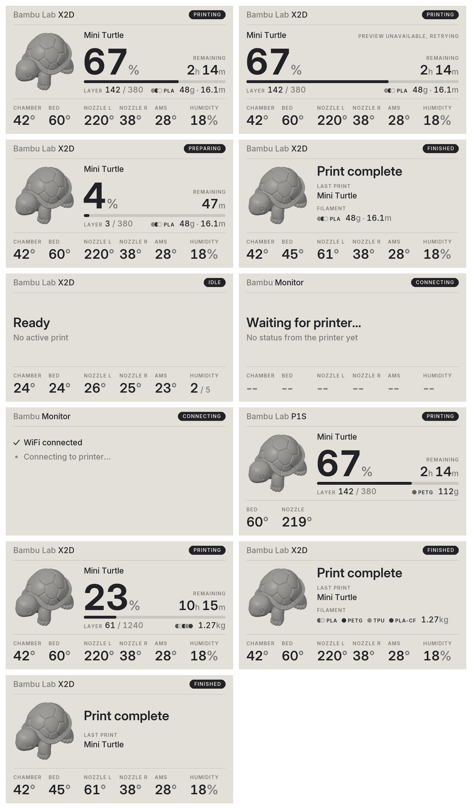

# Bambu Monitor ESP32

An e-paper status display for Bambu Lab printers. Shows print progress, temperatures and a preview of the current plate over your local network.

## Hardware

[LILYGO T5 4.7" E-paper V2.3 ESP32-S3](https://www.aliexpress.com/item/1005004647326743.html)

A microSD card is optional. If one is inserted, the display writes a log to `log.txt` and caches the current plate preview so it reappears straight away after a restart.

## Supported printers

Tested on the Bambu Lab X2D. Other Bambu printers with LAN mode should work too; readings a printer doesn't have (a second nozzle, chamber sensor or AMS) are simply left off the screen.

## Printer requirements

- **LAN mode** enabled, with the printer on the same network as the display.
- **Developer mode** enabled (needed on recent firmware for local MQTT and FTP access).
- The printer's IP address and access code, found on the printer under Settings > Network.

### Plate preview

The preview image is read from the print file on the printer's external USB drive, so the job must be sent to the printer over LAN (e.g. from Bambu Studio in LAN mode). Jobs sent through Bambu Lab cloud aren't stored there, so they print and show progress as normal but without a preview.

## Setup

1. Copy `Bambu_Monitor_ESP32/credentials.example.h` to `credentials.h` and fill in your WiFi, printer IP, access code and serial.
2. In the Arduino IDE, install the **esp32** board package **version 2.0.15** (the LilyGo-EPD47 library doesn't support 3.x).
3. Install libraries:
   - From GitHub (download the ZIP, then **Sketch > Include Library > Add .ZIP Library**):
     - [LilyGo-EPD47, `esp32s3` branch](https://github.com/Xinyuan-LilyGO/LilyGo-EPD47/tree/esp32s3)
     - [pngle](https://github.com/kikuchan/pngle)
   - From the Library Manager: PubSubClient 2.8, ArduinoJson 7.4.3.
4. Open `Bambu_Monitor_ESP32/Bambu_Monitor_ESP32.ino`, select **ESP32S3 Dev Module** with **PSRAM: OPI PSRAM**, **Flash Size: 16MB** and **Partition: 16M Flash (3MB APP/9.9MB FATFS)**, then upload.

## Tools

Optional helper scripts in `tools/`:

- `printer_state.py` connects to the printer (using `credentials.h`), saves its full status to `tools/bambu_dump.json` and prints a readable summary. Handy for checking what your printer reports. Needs `pip install paho-mqtt`.
- `preview/render.py` renders every screen layout to PNGs in `tools/preview/out`, so you can tweak the design without flashing the board. Needs g++, Pillow, numpy and the LilyGo-EPD47 library (set `EPD47_LIB` to its `src` folder if it isn't in `~/Documents/Arduino/libraries`).
- `make_fonts.py` regenerates the `font_*.h` headers from the Inter fonts in `tools/fonts`. Needs `pip install freetype-py`.

## Screens

## Credits

The Mini Turtle shown in the screenshots and preview is [Mini Turtle on MakerWorld](https://makerworld.com/en/models/2670421-mini-turtle#profileId-2955615).

## Licence

[PolyForm Noncommercial 1.0.0](PolyForm%20NonCommercial%201.0.0.txt): free to use, modify and share for any non-commercial purpose. The Inter fonts in `tools/fonts` (and the `font_*.h` headers generated from them) are under the [SIL Open Font License](tools/fonts/Inter-LICENSE.txt).

## Disclaimer

This is an independent hobby project and is not affiliated with, endorsed by or supported by Bambu Lab or Bambu Studio. "Bambu Lab" and printer model names are trademarks of their respective owners.

The software is provided as is, without warranty of any kind. Use it at your own risk; the author accepts no liability for any damage to your printer, prints or other equipment.

## Support

This is a hobby project shared for free. If it's been handy and you'd like to say thanks, a coffee is always appreciated.

